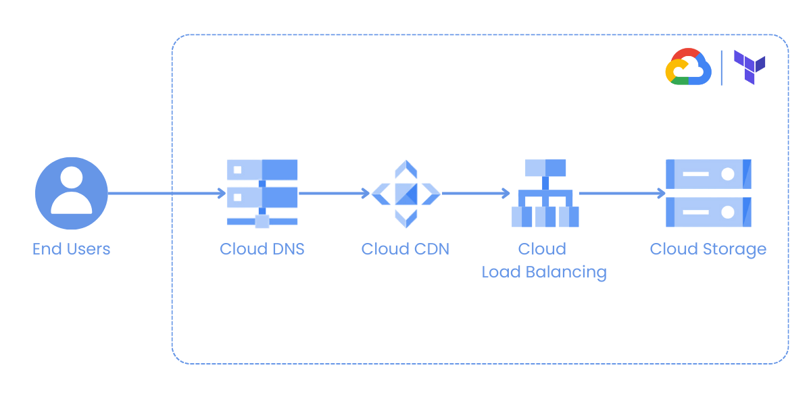

# Infrastructure Automation Using Terraform

This project demonstrates the automated setup of a website hosted on Google Cloud Platform (GCP) using Terraform. The infrastructure is provisioned and configured through Terraform scripts, enabling easy replication and management of essential services.

## Overview

The infrastructure includes the following services on Google Cloud Platform:

- **Cloud Storage:** Used for storing website assets such as images, CSS, and JavaScript files.
- **Cloud DNS:** Manages domain name resolution for the website.
- **Cloud CDN (Content Delivery Network):** Enhances website performance by caching content across global edge locations.
- **Cloud Load Balancing:** Distributes incoming traffic across multiple instances to ensure high availability and scalability.

## Requirements

To run these Terraform scripts, ensure the following prerequisites are met:

- **Google Cloud Platform Account:** Access to a GCP account with necessary permissions.
- **Terraform:** Installed and configured on your local machine.

## Architecture

## Code

The Terraform code is available under the `infra` directory. And the website code is available under the `website` directory.

**Terraform Initialization:**
    - Run `terraform init` to initialize the working directory containing the Terraform configuration files.

**Terraform Deployment:**
    - Review and modify the `main.tf` file as necessary, specifying variables like project IDs, regions, and configurations.
    - Run `terraform plan` to preview the changes Terraform will apply.
    - Run `terraform apply` to create the infrastructure on GCP based on the defined configuration.

## Usage

Once the Terraform scripts have successfully executed:

- Access the deployed website using the configured domain name.
- Explore the GCP console to view provisioned services like Cloud Storage, Cloud DNS, Cloud CDN, and Load Balancers.
- Make any necessary adjustments or updates to the infrastructure by modifying the Terraform configuration files and re-running `terraform apply`.

## Cleanup

To remove the provisioned infrastructure and resources:

- Run `terraform destroy` to tear down the resources created by Terraform.
- Verify in the GCP console that all associated resources are deleted as expected.

